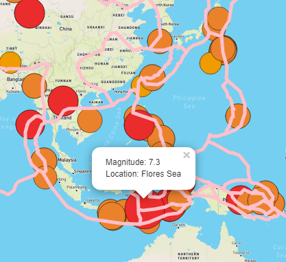
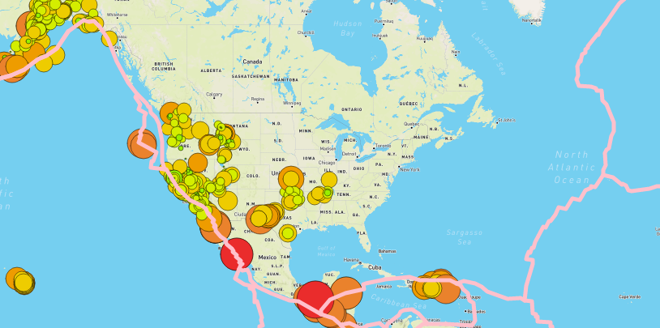

# Mapping_Earthquakes

## Project Overiew
The purpose of this analysis is to provide a webpage with insightful data visualizations with interactive features on earthquakes from around the world. With informative and easy-to-use earthquake maps, both for desktops and mobile phones, I seek to help out a disaster reporting network in need of some positive buzz.

## Resources
- Data sources: https://unpkg.com/leaflet@1.7.1/dist/leaflet.css, https://d3js.org/d3.v5.min.js, https://earthquake.usgs.gov/earthquakes/feed/v1.0/summary/all_week.geojson, https://raw.githubusercontent.com/fraxen/tectonicplates/master/GeoJSON/PB2002_boundaries.json, https://earthquake.usgs.gov/earthquakes/feed/v1.0/summary/4.5_week.geojson, 
- Software: Visual Studio Code 1.60.2, JavaScript 1.7, D3.js, HTML 5, CSS 3

## Results
In my role, I support website and mobile application development by using the latest earthquake GeoJSON data from the US geological survey website. My code traverses and retrieves the earthquake data using JavaScript and the d3 and Leaflet libraries, and it plots the data on a Mapbox map through an API request.

On my map, the magnitude and location of each earthquake appears in a popup marker. The diameter of the markers for each earthquake reflects the magnitude of the earthquake in the marker's size and color. Earthquakes with higher magnitudes appear larger and darker in color, with a legend for my map data.

Finally, to illustrate the relationship between location and frequency of seismic activity and tectonic plates, I added fault lines to the map. You can see them as the pink line running across the globe map.